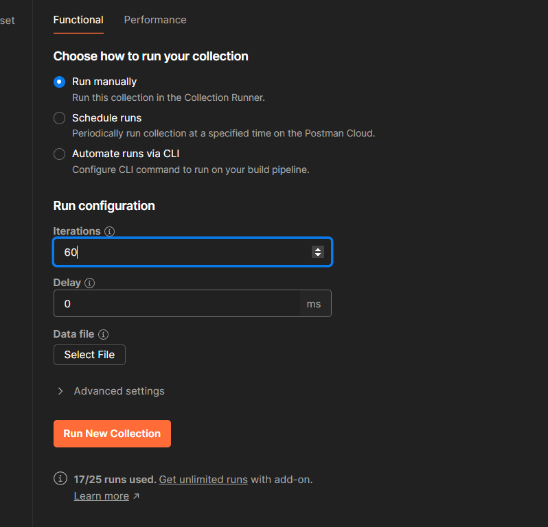

Rate Limiter Based on User
===
Change the `user.ratelimit.ms` to control the rate limit. If 
```
user.ratelimit.ms = 3000
``` 
then, user can access x requests within 3000ms. Change this property according to the requirement.

### Postman screenshots
---
Postman collection test run with user2 where max request per 3 seconds is **20**




